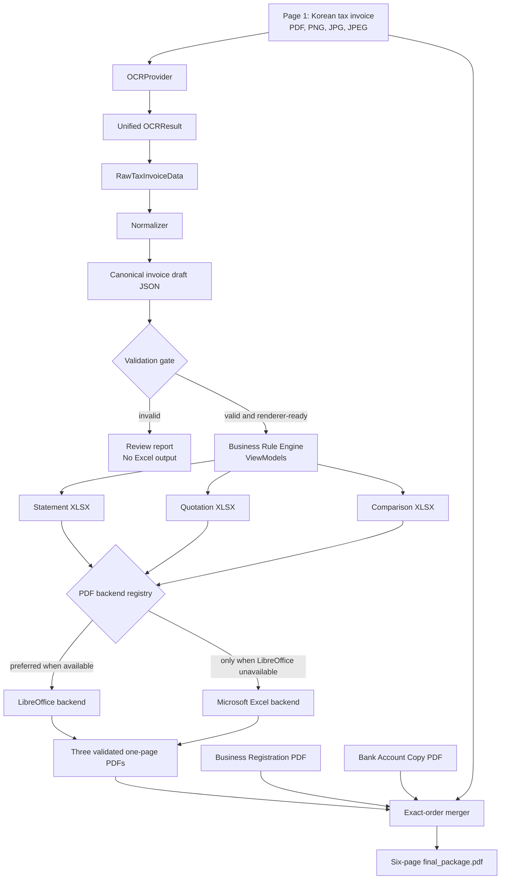

# Architecture

## End-to-end flow



The final package order is fixed:

```text
1 Tax invoice
2 Statement
3 Quotation
4 Comparison Quotation
5 Business Registration
6 Bank Account Copy
```

## Component boundaries

| Component | Responsibility | Must not own |
|---|---|---|
| `web` | Upload, progress, editable review, read-only previews, and downloads | OCR, pricing, normalization, or generation rules |
| `extraction.providers` | Convert source documents to `OCRResult` | Canonical pricing or workbook rendering |
| `extraction.normalizer` | Preserve and normalize extracted values | Missing-value invention |
| `extraction.validator` | Schema, required-field, confidence, and arithmetic checks | Silent correction |
| `business` | Canonical validation, pricing, and ViewModels | OCR or template mutation |
| `excel_renderer` | Copy authoritative templates and update mapped cells | Pricing decisions |
| `document_generator` | Atomic three-workbook generation and preservation checks | OCR |
| `pipeline` | Connect OCR validation to document generation | Provider-specific SDK formats |
| `package.backends` | Convert workbook copies to PDFs | Merge order or business rules |
| `package` | Validate, order, merge, and atomically publish PDFs | OCR or workbook mutation |

The web application uses Next.js Route Handlers as a local transport boundary.
Those handlers invoke existing Python services and return session-scoped JSON
or file downloads. Reviewed canonical JSON is sent to the existing document
generator; React never recalculates pricing or invoice totals.

The web preview layer runs only after successful workbook generation. It
serves the final PDF inline when packaging succeeds. If no PDF backend is
usable, it renders read-only HTML views from the generated XLSX files and
combines them with inline source/fixed documents in the same six-page order.
This fallback does not modify workbooks or replace the package validator.

## Data contracts

Provider SDK objects terminate inside an OCR adapter. Downstream extraction
receives only `OCRResult`, including neutral text, tables, boxes, confidence,
and metadata.

`RawTaxInvoiceData` retains source values and optional confidence. The
normalizer emits the canonical JSON shape governed by
`configs/invoice.schema.json`. The Business Rule Engine is the only owner of
comparison markup, loaded from `configs/business_rules.json`.

## Immutability and atomicity

- Original Excel templates are read-only authoritative assets.
- Renderers copy templates before modifying mapped dynamic cells.
- Source workbook hashes are checked around PDF conversion.
- Document generation stages all three workbooks before publication.
- PDF packaging stages every intermediate and the final PDF in a temporary
  directory.
- Existing final outputs are replaced only after complete validation.

## Validation gates

1. Input inspection: supported type, readable content, and one source page.
2. Extraction validation: required values, Korean identifiers/dates, confidence,
   arithmetic, and canonical schema.
3. Renderer readiness: fields required by existing workbook mappings.
4. Workbook validation: template hashes, sheets, totals, formulas, styles,
   images, merges, dimensions, and print settings.
5. Intermediate PDF validation: header, readability, nonblank content, one
   page, and A4 portrait dimensions.
6. Package validation: exact order fingerprints and exactly six pages.

## Errors and logging

Core libraries raise domain errors such as `ExtractionError`,
`GenerationError`, and `PackageError`; they do not convert failures into
partial success. CLI entry points translate those errors to nonzero exit codes
and human-readable stderr.

CLI status messages use plain lines and explicit paths. The package generator
uses numbered progress events and accepts an injectable logger callback.
Detailed package errors retain the backend, command, exit status, stdout,
stderr, temporary path, and source-hash result.

This split is intentional: application code can later route progress events to
structured logging without changing generation results or file formats.

## Configuration

Business configuration is centralized in `configs/`. Platform executable
locations remain inside their backend adapters because they are detection
rules, not business configuration. Templates and reference PDFs remain under
`reference/rmntc/`.

The existing default project-root conventions and RMNTC fixed-asset page
indices are currently embedded in orchestration code. Moving these to a
company manifest is deferred because Phase F forbids pipeline and generator
behavior changes.

## Deployment prerequisites

- Python 3.9+
- Dependencies from `requirements.txt`
- Development dependencies from `requirements-dev.txt`
- Optional PaddleOCR dependencies from `requirements-ocr.txt`
- A platform-compatible PaddlePaddle inference engine
- LibreOffice for the preferred PDF backend, or licensed Microsoft Excel on
  macOS
- Korean fonts compatible with authoritative workbook templates
- Writable staging space beside output destinations

No deployment configuration is included in this phase.

## Extension points

- Add OCR engines by implementing `OCRProvider` and registering an adapter.
- Add companies through future company manifests, templates, mappings, and
  fixed assets.
- Add PDF engines by implementing `PDFBackend` and defining explicit registry
  priority.
- Add a frontend after human approval, authorization, job-state, and retention
  boundaries are designed.
